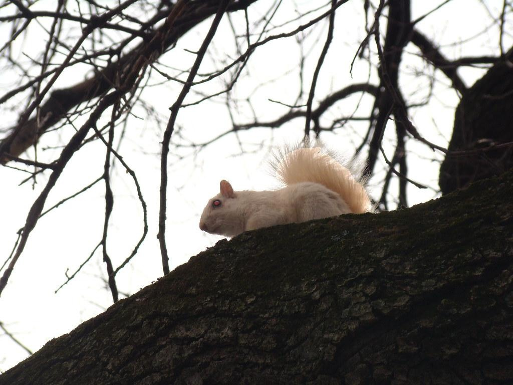
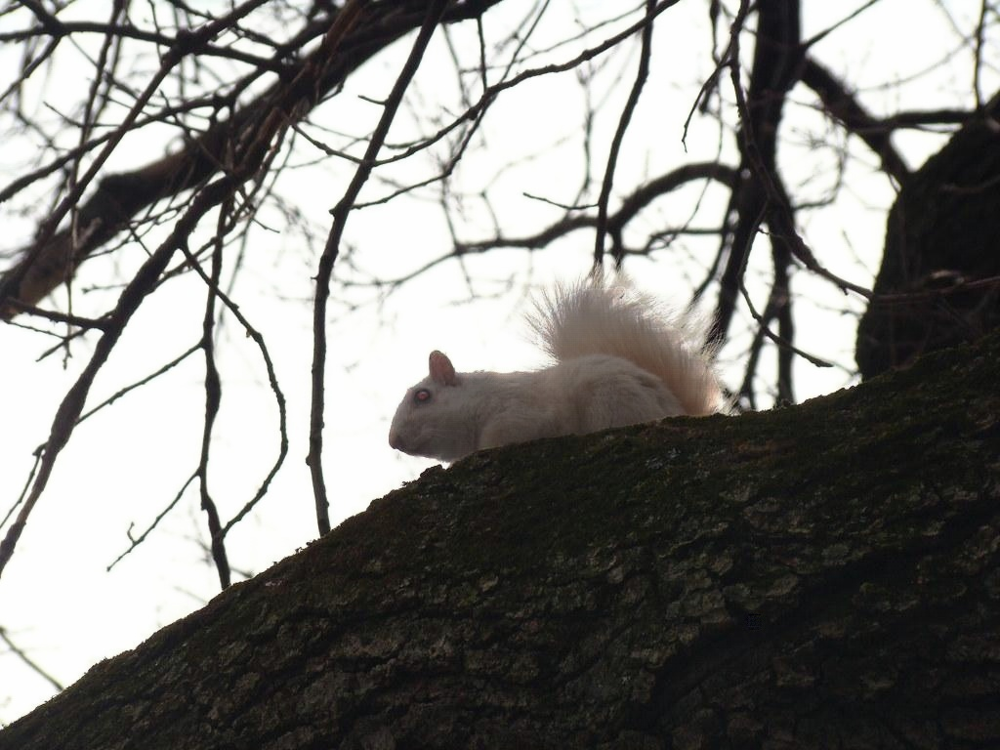

# 📝 image harmonization for copy-and-paste

---

Harmonize the composite image created by copying and pasting a foreground object onto a different background.

This harmonization algorithm blends the foreground object with the background, making the synthesized image appear more natural.

It can be used to make copy-and-paste training images more photorealistic.

<table>
  <tr>
    <td>
      
      <br />
      <div style="text-align: center;"><em>composite image</em></div>
    </td>
    <td>
      
      <br />
      <div style="text-align: center;"><em>harmonized image</em></div>
    </td>
  </tr>
</table>

This repository implements an algorithm described in [1], which uses a UNet-based network and Partial Convolution [2] layers to extract image features. Additionally, it employs a triplet loss to bring the styles of the foreground object and background closer together.

## How to Train

---

- Download [iHarmony4 dataset](https://github.com/bcmi/Image-Harmonization-Dataset-iHarmony4) which consists of 4 sub-datasets: HCOCO, HAdobe5k, HFlickr, Hday2night, and extract into ./data/iharmony in the following structure:

```
data
    --iharmony
              --HAdobe5k
              --HCOCO
              --Hday2night
              --HFlickr
```

- Run training script (modify [./config/base.yaml](./config/base.yaml) if necessary).

```bash
python3 scripts/train.py
```

## How to Run

---

- Download model weights

```bash
wget https://huggingface.co/xmba15/model_zoo/resolve/main/bargain_net/bargain_net.pth
```

- Test inference on single image

```bash
python3 scripts/test_inference_single_image.py \
                                         --weights_path ./bargain_net.pth \
                                         --composite_path ./assets/composite.jpg \
                                         --mask_path ./assets/mask.png \
```


## 🎛 Development environment

---

```bash
mamba env create --file environment.yml
mamba activate image_harmonization
```

## :gem: References

---

- [1] [Cong, Wenyan, et al. "Bargainnet: Background-guided domain translation for image harmonization." 2021 IEEE International Conference on Multimedia and Expo (ICME). IEEE, 2021.](https://github.com/bcmi/BargainNet-Image-Harmonization)

- [2] [Liu, Guilin, et al. "Image inpainting for irregular holes using partial convolutions." Proceedings of the European conference on computer vision (ECCV). 2018.](https://openaccess.thecvf.com/content_ECCV_2018/papers/Guilin_Liu_Image_Inpainting_for_ECCV_2018_paper.pdf)
